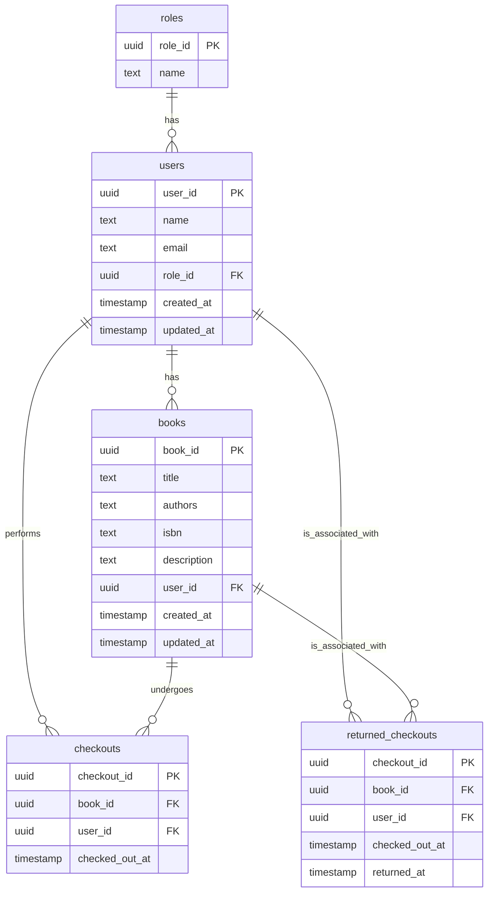

```mermaid
erDiagram
    books {
        uuid book_id PK
        text title
        text authors
        text isbn
        text description
        uuid user_id FK
        timestamp created_at
        timestamp updated_at
    }

    users {
        uuid user_id PK
        text name
        text email
        uuid role_id FK
        timestamp created_at
        timestamp updated_at
    }

    roles {
        uuid role_id PK
        text name
    }

    checkouts {
        uuid checkout_id PK
        uuid book_id FK
        uuid user_id FK
        timestamp checked_out_at
    }

    returned_checkouts {
        uuid checkout_id PK
        uuid book_id FK
        uuid user_id FK
        timestamp checked_out_at
        timestamp returned_at
    }

    users      ||--o{ books              : "has"
    roles      ||--o{ users              : "has"
    users      ||--o{ checkouts          : "performs"
    books      ||--o{ checkouts          : "undergoes"
    users      ||--o{ returned_checkouts : "is_associated_with"
    books      ||--o{ returned_checkouts : "is_associated_with"
```
